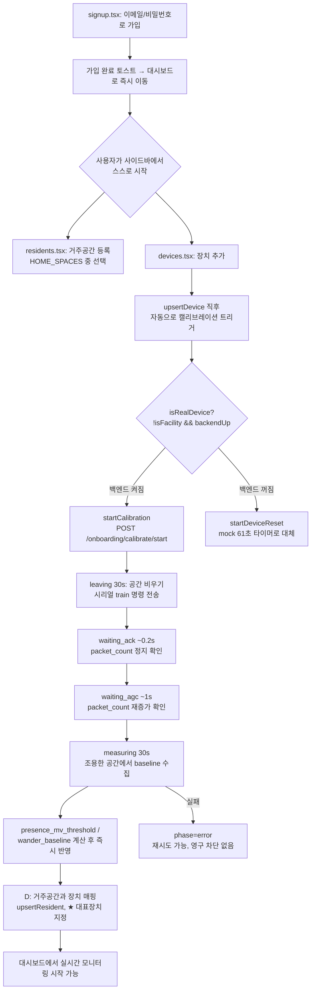
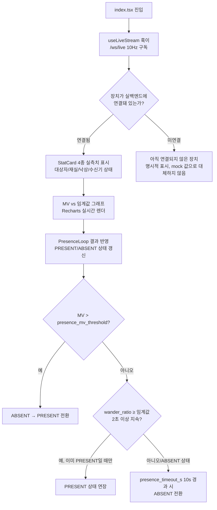
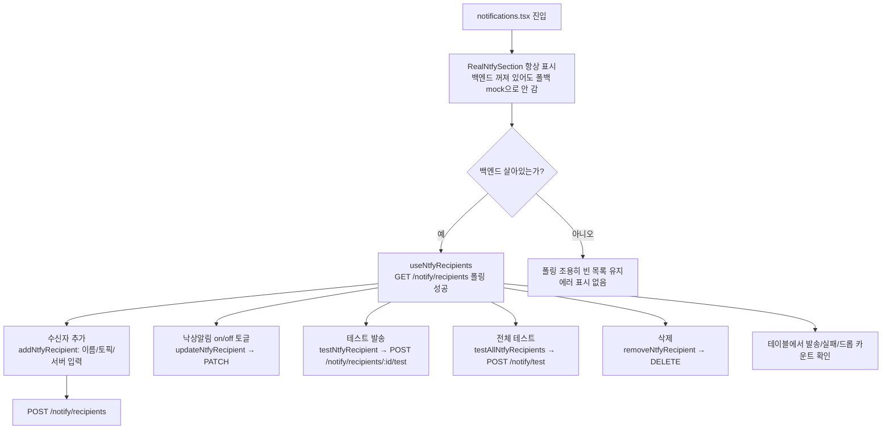
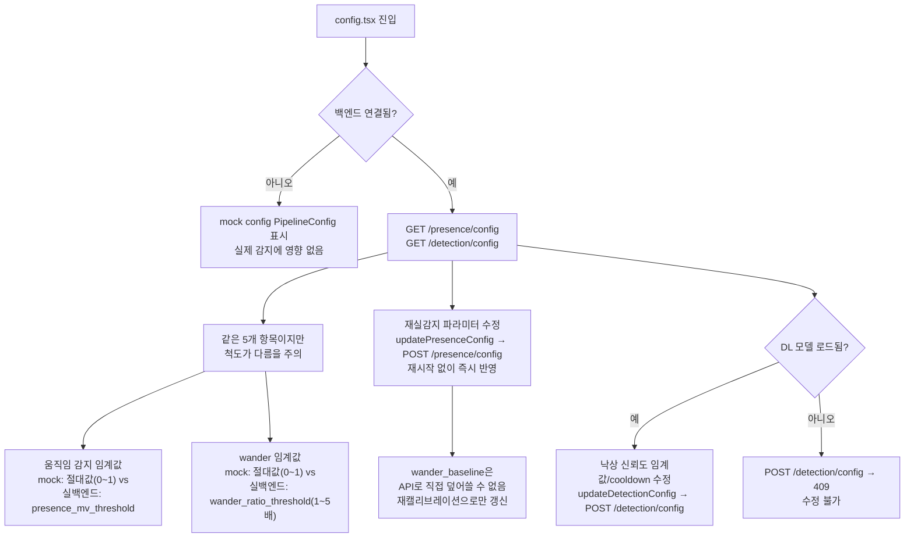

# CSI-Guard HOME 사용자 유저플로우 v1.0

`CSI-Guard_기능명세서_v2.0_20260715.md` 기준으로 정리한 HOME(가정) 계정 시나리오별 유저플로우.
FACILITY는 100% mock이라 별도 문서 대상에서 제외하고, 실백엔드(`backend/`)가 실제로 개입하는 HOME 흐름만 다룬다.

---

## 시나리오 1. 신규 가입 → 최초 장치 등록·캘리브레이션

강제 온보딩 위저드가 없으므로(§1.2 "로그인/회원가입"), 사용자가 사이드바에서 직접 시작해야 한다.



**주의점**
- 캘리브레이션은 총 약 61초(`fe5e26f`에서 31초→61초로 연장) — 이 시간 동안 공간을 비워야 baseline이 정확하다.
- 장치 등록과 거주자↔장치 매핑은 별개 화면(devices.tsx / residents.tsx)이라 순서가 강제되지 않는다. 장치만 등록하고 거주자 매핑을 건너뛰어도 캘리브레이션 자체는 끝난다.
- 백엔드가 꺼져 있으면 사용자는 인지하지 못한 채 mock 타이머(`startDeviceReset`)로 빠지고, 실제 baseline은 계산되지 않는다.

---

## 시나리오 2. 일상적 재실 모니터링



**주의점**
- wander 신호는 PRESENT를 "연장"만 할 뿐, ABSENT→PRESENT를 새로 발생시키지 못한다(순간 노이즈 오탐 방지, `fe5e26f`). 사용자가 조용히 누워 wander만 잡히는 상태에서 처음부터 재실로 잡히지는 않는다는 뜻.
- 이 화면의 "⚠ 낙상 시뮬레이션" 버튼(`simulateFall()`)은 실백엔드 여부와 무관하게 항상 mock 이벤트를 강제로 만든다 — 데모/테스트용이며 실제 감지 파이프라인을 거치지 않는다.

---

## 시나리오 3. 낙상 발생 → 감지 → 알림 (2개의 독립 경로)

낙상 상태머신이 FALL로 전이하는 순간, **서로 코드로 연결되지 않은 두 경로**가 동시에 트리거된다.

```mermaid
flowchart TD
    A[FallDetector: 0.25s stride<br/>3초 윈도우 추론] --> B{softmax 확률 ≥ 0.468?}
    B -->|예 raw positive| C[최근 5개 raw 예측 중<br/>causal majority vote]
    C -->|다수결 positive| D[상태머신 SUSPECT → FALL 확정]
    D --> E1[경로1: 앱 내부]
    D --> E2[경로2: 실제 푸시]

    E1 --> F1["/ws/live의 detect_state 구독"]
    F1 --> G1[FallAlarmModal 전체화면 표시<br/>자동 30초 타임아웃 없음 - 57d2064]
    G1 --> H1{사용자 응답}
    H1 -->|응급 출동 확인| I1[대응 기록]
    H1 -->|오탐지 처리| J1[FALSE_ALARM으로 기록]

    E2 --> F2[notifier.py _emit_fall]
    F2 --> G2[등록된 모든 ntfy 수신자에게<br/>병렬 발송, 수신자별 독립 큐]
    G2 --> H2{발송 성공?}
    H2 -->|실패| I2[최대 3회 재시도<br/>백오프 1s/2s]
    H2 -->|성공| J2[휴대폰 ntfy 앱에 알림 도착<br/>"낙상이 감지되었습니다..."]
    I2 -->|3회 모두 실패| K2[카운트만 기록, 포기<br/>재시작 후 재시도 없음]

    D --> L[COOLDOWN 10초 진입<br/>동일 낙상 중복 ntfy 방지]
```

**주의점**
- 경로1(앱 모달)과 경로2(ntfy 푸시)는 **완전히 독립**이다 — 앱을 꺼둔 상태에서도 ntfy 푸시는 오고, 반대로 ntfy 서버 장애가 나도 앱 모달은 뜬다. 사용자에게 "둘 다 확인해야 완결"이라는 점을 안내할 필요가 있다.
- 모달은 오늘 자 변경(`57d2064`)으로 사람이 명시적으로 응답할 때까지 닫히지 않는다 — 이전처럼 30초 후 자동으로 PENDING 처리되며 사라지지 않으므로, 사용자가 자리를 비운 상태에서 낙상이 발생하면 모달은 무한정 떠 있는 채로 남는다(ntfy 푸시가 실질적인 1차 알림 수단이 됨).
- COOLDOWN(10초)이 끝나기 전 재낙상이 감지되어도 ntfy는 다시 발송되지 않는다.

---

## 시나리오 4. 오탐지 이력 확인·정정

```mermaid
flowchart TD
    A[FallAlarmModal에서<br/>"오탐지 처리" 선택] --> B[history.tsx로 이동해<br/>전체 낙상 이력 확인 가능]
    B --> C[응답상태 필터:<br/>전체/대기중/확인함/출동중/오탐지]
    C --> D[행 클릭 → 상세 패널 확장]
    D --> E["낙상 전후 6초 파형 표시<br/>주의: fall.id 시드 PRNG로 재구성한<br/>시각화, 실제 저장 CSI/MV 아님"]
    D --> F[updateResponse fall.id, value<br/>상태 재변경 가능]
    B --> G[CSV 내보내기<br/>클라이언트 전용 Blob, 서버 호출 없음]
```

**주의점**
- 파형 상세는 실제 원본 센서 데이터가 아니라 결정론적으로 재구성된 시각화다 — 사용자가 "그때 정확히 어떤 움직임이었는지"를 법적/의학적 근거로 쓸 수 없다는 점을 알아야 한다.
- 원본 CSI/MV 샘플은 현재 어떤 낙상 이벤트에도 보존되지 않는다(§2.4 DB 연결 미구현과 연동된 한계).

---

## 시나리오 5. 알림 수신자(가족) 등록·관리



**주의점**
- 백엔드가 꺼져 있을 때 사용자는 "왜 수신자 목록이 비어 보이는지" 알 수 있는 에러 메시지를 못 받는다 — 조용히 빈 상태로 유지되는 알려진 동작.
- `--ntfy-topic`/`NTFY_TOPIC` 환경변수로 자동 등록된 초기 수신자 1명은 이 화면의 CRUD로도 동일하게 관리된다.

---

## 시나리오 6. 감지 파라미터 튜닝



**주의점**
- mock의 `wander_threshold`(절대값)와 실백엔드의 `wander_ratio_threshold`(baseline 대비 배수)는 이름은 비슷하지만 서로 변환되지 않는 별개 숫자 — 사용자가 mock에서 익힌 값 감각을 실백엔드에 그대로 옮기면 안 된다.
- DL 모델이 로드되지 않은 상태(`--no-model` 등)에서는 낙상 파라미터 변경 시도가 409로 거부된다.

---

## 시나리오 7. 장치 재설정(재캘리브레이션) — 드리프트 대응

```mermaid
flowchart TD
    A[devices.tsx: 기존 장치의<br/>"장치 재설정" 클릭] --> B[동일하게 POST /onboarding/calibrate/start<br/>재캘리브레이션 전용 엔드포인트 없음]
    B --> C[leaving 30s → waiting_ack → waiting_agc → measuring 30s<br/>총 약 61초, 최초 등록과 완전히 동일한 절차]
    C --> D[과거 캘리브레이션 이력 보관 안 함<br/>새 결과로 덮어씀]
    D --> E[presence_mv_threshold /<br/>wander_baseline 갱신, 즉시 적용]
    C -->|실패| F[phase=error → 재시도 가능]
```

**주의점**
- 가구 배치가 바뀌거나 RF 간섭이 늘어나 드리프트가 의심될 때, 사용자가 **직접** 이 버튼을 눌러야 한다 — 자동/주기적 재캘리브레이션은 아직 없음(§2.4 로드맵).
- 재캘리브레이션 중에는 이전 baseline이 그대로 남아있다가 완료 시점에 한 번에 덮어써지므로, 61초 동안은 기존 임계값으로 계속 감지가 동작한다.

---

## 시나리오 8. 백엔드 오프라인 상황 대응

```mermaid
flowchart TD
    A[홈 서버(backend/main.py)가<br/>실행되지 않았거나 크래시] --> B[BackendDetectionBridge<br/>setBackendConnected false]
    B --> C[AppSidebar 상태등 오프라인 표시<br/>backendConnected 플래그 기준]
    B --> D[index.tsx: 해당 장치<br/>"아직 연결되지 않은 장치" 표시]
    B --> E[notifications.tsx: 수신자 목록<br/>조용히 빈 상태]
    B --> F[devices.tsx: 진단 패널 미표시<br/>HOME+백엔드 연결 시에만 노출]
    A --> G{장치 추가/재설정 시도?}
    G -->|예| H[isRealDevice = false로 판정<br/>mock 61초 타이머로 대체 진행<br/>실제 baseline은 계산 안 됨]
```

**주의점**
- 오프라인 상태에서도 UI 자체는 에러 없이 "정상처럼" 보이는 지점이 여럿 있다(빈 수신자 목록, mock 캘리브레이션 등) — 사용자가 백엔드 프로세스가 꺼진 걸 스스로 인지하기 어렵다. 상태등(사이드바)과 "연결되지 않은 장치" 배지가 사실상 유일한 신호다.

---

## 참고: 시나리오 간 공유 전제

- 모든 화면은 `AuthGate`를 통과해야 렌더되며, 로그인 상태에서만 `AppSidebar`/`FallAlarmModal`/`BackendDetectionBridge`가 항상 마운트되어 있다 — 즉 사용자가 어느 페이지에 있든 낙상 알람과 백엔드 연결 감시는 백그라운드에서 계속 동작한다.
- HOME 계정은 온보딩 위저드가 없으므로, 시나리오 1(장치 등록)은 강제되지 않는다 — 가입만 하고 아무것도 등록하지 않은 상태로 대시보드를 볼 수도 있다(그 경우 시나리오 2~8은 발생하지 않음).
