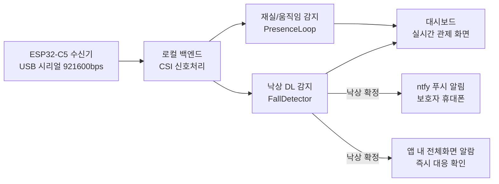
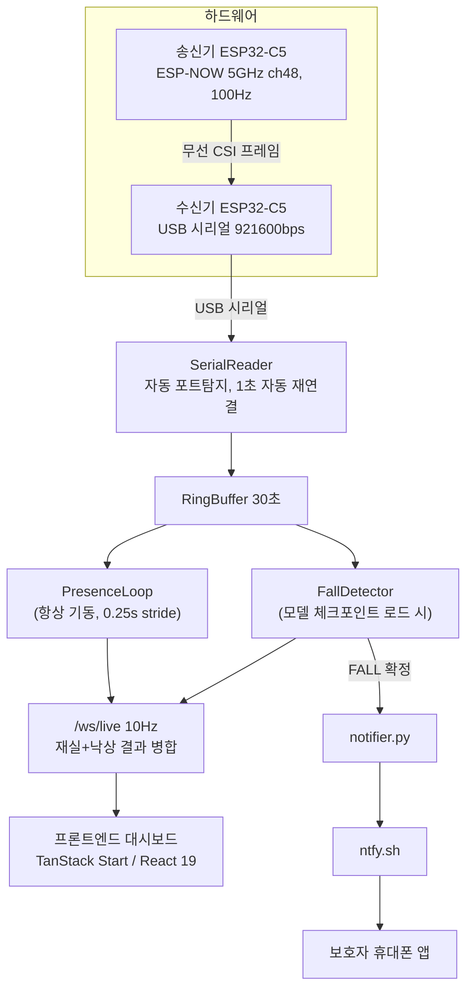

# CSI-Guard 어플리케이션 보고서

**Wi-Fi CSI 기반 비접촉 낙상 감지 시스템**

작성일 2026-07-15 · v1.0

---

## 1. 프로젝트 개요

| 항목 | 내용 |
|---|---|
| 프로젝트명 | CSI-Guard |
| 한 줄 소개 | 카메라·웨어러블 없이 전용 Wi-Fi 송수신 모듈의 전파 채널 정보(CSI)만으로 낙상을 실시간 감지하는 비접촉 관제 시스템 |
| 대상 사용자 | 1인 가구·고령자 가정(HOME), 요양시설(FACILITY) |
| 핵심 기술 | Wi-Fi CSI 신호처리, 이중 브랜치 ResNet18 기반 딥러닝 낙상 분류, 로컬 실시간 파이프라인 |
| 개발 범위 | 프론트엔드 대시보드(TanStack Start) + 가정용 실시간 로컬 백엔드(FastAPI, ESP32-C5 연동) |

CSI-Guard는 독거 고령자·1인 가구의 낙상 사고를 **영상 촬영 없이** 실시간으로 감지하고, 사고 발생 시 보호자에게 즉시 알림을 전달하는 시스템이다. 특수 웨어러블 기기의 착용 부담과 카메라의 사생활 침해 우려를 동시에 해소하기 위해, 소형 ESP32-C5 송신기·수신기 한 쌍을 감지 대상 공간에 전용으로 설치하고, 두 기기 사이에서 오가는 Wi-Fi 전파의 채널 상태 정보(Channel State Information, CSI)를 감지 신호로 사용한다. 기존에 설치된 가정용 공유기를 그대로 활용하는 방식이 아니라, 감지 목적으로 별도 구성한 송수신 링크에서 CSI를 측정한다는 점에 유의해야 한다.

---

## 2. 문제 정의 및 배경

### 2.1 사회적 배경

- 고령자 낙상은 골절·와상(臥床)으로 이어지는 가장 흔한 가정 내 안전사고이며, 특히 **1인 가구 고령자**는 낙상 후 초기 대응이 늦어질수록 예후가 급격히 악화된다.
- 기존 대응 수단은 두 축으로 나뉜다.
  - **영상(CCTV/AI 카메라) 기반**: 감지 정확도는 높지만 상시 촬영에 대한 사생활 침해 거부감이 커 화장실·침실 등 낙상 고위험 공간에는 설치 자체가 기피된다.
  - **웨어러블(응급호출 목걸이 등) 기반**: 사용자가 착용을 잊거나, 낙상으로 의식을 잃어 스스로 버튼을 누르지 못하면 무용지물이 된다.
- 두 방식 모두 "고위험 공간을 상시 감지하면서도 신체 접촉·촬영이 없어야 한다"는 요구를 동시에 만족하지 못한다.

### 2.2 기술적 공백

Wi-Fi CSI 기반 비접촉 센싱은 학계에서 활동/낙상 인식 연구가 꾸준히 진행되어 왔지만, 다음 이유로 실제 가정에 적용된 사례는 드물다.

1. 대부분의 연구가 **오프라인 데이터셋 검증**에 그치고, 실제 하드웨어에서 수신부터 판정까지 이어지는 **실시간 E2E 파이프라인**을 구축하지 않는다.
2. 낙상 감지(저빈도·고위험 이벤트)와 재실/움직임 감지(상시 필요)를 하나의 파이프라인으로 묶으면, 모델 로드 실패 등 한쪽 장애가 다른 쪽까지 마비시키는 구조적 취약점이 생긴다.
3. 감지 이후 "누구에게 어떻게 알릴 것인가"까지 포함한 제품 단위 설계가 부족하다.

CSI-Guard는 이 세 지점을 각각 실측 하드웨어 연동, 재실감지/낙상감지의 완전 분리 아키텍처, ntfy 기반 실제 푸시 알림으로 대응한다(§4, §5 참조).

---

## 3. 서비스 소개

### 3.1 서비스 유형

| 유형 | 대상 | 데이터 소스 |
|---|---|---|
| HOME (가정) | 1인 가구·재가 고령자, 장치 1대 | 실제 로컬 백엔드(`backend/`)가 ESP32-C5 수신기로부터 실시간 CSI를 받아 처리 |
| FACILITY (시설) | 요양시설의 다수 입소자·다수 장치 | 현재는 UI/UX 검증을 위한 시뮬레이션(§7 "개발 현황" 참고) |

본 보고서는 실제 감지 파이프라인이 동작하는 **HOME 시나리오**를 중심으로 서술한다.

### 3.2 핵심 기능 흐름

1. **상시 재실/움직임 모니터링**: 사용자가 공간에 있는지, 활동 중인지를 실시간으로 표시한다.
2. **낙상 실시간 감지**: 0.25초마다 최근 3초 구간을 딥러닝 모델로 판정, 이상 징후 발생 시 수 초 내 확정한다.
3. **이중 알림 경로**: 보호자 휴대폰으로의 푸시 알림(ntfy)과 앱 내 전체화면 알람이 서로 독립적으로 동시에 동작해, 한쪽 경로 장애가 알림 실패로 이어지지 않는다.
4. **이력 관리**: 낙상 이벤트 이력, 응답 상태(확인/출동/오탐지) 추적, 감지 파라미터의 현장 튜닝(캘리브레이션)을 지원한다.

---

## 4. 기술 아키텍처

### 4.1 시스템 구성도

### 4.2 핵심 설계 결정: 재실감지·낙상감지의 완전한 스레드 분리

`PresenceLoop`(재실/움직임)와 `FallDetector`(낙상 딥러닝)는 같은 링버퍼를 읽되 **서로 상태를 공유하지 않는 독립 스레드**로 구현했다. 초기 구현에서는 재실감지가 낙상 감지기 내부 로직으로 묶여 있었는데, 딥러닝 모델 체크포인트가 없거나 로드에 실패하면(`--no-model` 모드 등) 재실/움직임 출력까지 통째로 죽는 문제가 발견되어 분리했다. 이후로는 시리얼 수신만 유지되면 모델 로드 여부와 무관하게 재실감지가 항상 동작하며, `/ws/live` WebSocket도 이 원칙을 그대로 반영해 재실 필드는 연결만 되면 항상 존재하고 낙상 필드는 모델 로드 시에만 추가된다. **상시 필요한 기능(재실감지)이 저빈도 고위험 기능(낙상 감지 모델)의 장애에 영향받지 않도록 설계한 것**이 이 아키텍처의 핵심이다.

### 4.3 신호처리 파이프라인

| 구분 | 재실/움직임 감지 | 낙상 감지 |
|---|---|---|
| 입력 윈도우 | MV 3초 / wander 10초 | 3초, 0.25초 스트라이드 반복 추론 |
| 전처리 | 리샘플 → 밴드패스 → 상위 10개 서브캐리어 선택(q-value) → 합산·정규화 | S3 스칼로그램(224×224), PCA-ACF(1×128×64, lag 0.4초) 두 종류 피처 추출(상위 30개 서브캐리어 PCA 선택) |
| 판정 방식 | MV 임계값(캘리브레이션 산출) 초과 시 활동, Welch band-energy 비율로 wander 판정 | `DualBranchResNet`(ResNet-18 이중분기) softmax 확률 → 임계값 → 최근 5개 예측 causal 다수결 |
| 상태머신 | PRESENT/ABSENT | IDLE → SUSPECT → FALL → COOLDOWN(10초) |

### 4.4 실측 성능

연구단 제공 서비스 모델(`Window3BestModelInference`, DualBranchResNet)의 오프라인 검증 결과:

- **Macro F1 0.8936**, **낙상 Recall 0.75** (판정 임계값 0.468 + 5윈도우 다수결 후처리 기준)
- 실시간 환경에서는 미래 데이터를 쓸 수 없어 중심-윈도우 다수결(mode5) 대신 **인과적(causal) 다수결**로 대체 — 지연 없이 즉시 판정 가능한 구조로 전환했다.
- 실측 추론 지연: 피처추출+모델추론 합산 **약 42ms/window**, 0.25초 스트라이드 예산 대비 충분한 여유 확보.
- 실제 하드웨어 수신 성능(검증 완료): 약 **91Hz** 프레임 수신(5초 표본, 체크섬 통과 기준), RSSI 평균 **-46dBm**.

즉, CSI-Guard는 논문 수준의 오프라인 지표에 그치지 않고 **실제 ESP32-C5 하드웨어 → 시리얼 수신 → 실시간 추론까지 이어지는 전 구간을 자체 계측**했다는 점이 특징이다.

### 4.5 기술 스택

| 계층 | 기술 |
|---|---|
| 하드웨어 | ESP32-C5 송신기/수신기 2대, ESP-NOW 무선 CSI 전송, USB 시리얼 바이너리 프로토콜 |
| 백엔드(HOME) | Python, FastAPI, PyTorch(DualBranchResNet), REST 19종 + WebSocket 1종(`/ws/live`) |
| 프론트엔드 | TanStack Start(React 19), TanStack Router, Tailwind CSS v4, shadcn/ui, Recharts |
| 알림 | ntfy(자체 호스트 가능한 오픈소스 푸시 게이트웨이) — 외부 상용 SMS/FCM 없이 낙상 알림 실전달 |

---

## 5. 핵심 차별점

### 5.1 비접촉·프라이버시 보호

카메라·영상 저장이 전혀 없다. 감지에 사용하는 신호는 Wi-Fi 전파의 채널 상태 정보(진폭/위상 변화)뿐이며, 이 신호만으로는 사람의 얼굴이나 신체 이미지를 복원할 수 없다. 따라서 화장실·침실처럼 영상 카메라 설치가 사실상 불가능한 고위험 공간에도 감지 커버리지를 확보할 수 있다. 별도 웨어러블 착용도 요구하지 않으므로, 착용을 잊거나 낙상으로 조작이 불가능한 상황에서도 감지가 계속 동작한다.

### 5.2 실측 딥러닝 기반 낙상 감지

이동분산 임계값 같은 단순 규칙이 아니라, S3 스칼로그램과 PCA-ACF 두 종류의 피처를 입력으로 하는 이중 브랜치 ResNet18 모델로 판정한다. Macro F1 0.8936의 오프라인 검증 성능을 실시간 인과적 다수결 구조로 이식해, 지연 없이 동일한 판정 품질을 지향한다(§4.4).

### 5.3 독립 이중 스레드 구조의 신뢰성

재실/움직임 감지와 낙상 딥러닝 감지를 완전히 분리된 스레드로 설계해, 모델 로드 실패·업데이트 중 등 낙상 감지 쪽에 문제가 생겨도 "지금 사람이 그 공간에 있는지"라는 가장 기본적인 안전 신호는 끊기지 않는다(§4.2). 상용 안전 서비스에서 요구되는 **부분 장애 내성(graceful degradation)**을 초기 설계 단계부터 반영했다.

### 5.4 실제 하드웨어와 연동된 로컬 우선(local-first) 파이프라인

시뮬레이션 목업이 아니라 ESP32-C5 실기기 → USB 시리얼 → 로컬 FastAPI 서버 → 대시보드까지 전 구간이 실제로 동작하며, 클라우드 서버나 외부 DB 없이 사용자 로컬 환경에서 완결된다. 이는 개인 생체·행동 데이터가 외부로 나가지 않는다는 프라이버시 원칙과도 직결된다. 낙상 확정 시의 유일한 외부 통신은 ntfy를 통한 푸시 알림 전송뿐이며, 이마저도 앱 내부 HTTP/WebSocket 경로와는 독립된 별도 경로로 동작해 알림 신뢰성을 이중화했다(§3.2).

### 5.5 비접촉 센싱 대안(mmWave 레이더 등) 대비 경제성

비접촉 낙상 감지의 대표적인 대안은 mmWave(FMCW) 레이더 기반 센서다. 사람의 위치·자세를 고해상도로 추정할 수 있어 감지 정밀도 자체는 우수하지만, 다음과 같은 구조적 비용 부담이 있다.

- **전용 RF 하드웨어**: mmWave 레이더는 60GHz/77GHz 대역 전용 안테나·RF 프론트엔드가 필요한 특수 목적 모듈로, 범용 Wi-Fi SoC 대비 부품 단가와 개발 난이도가 높다.
- **인증·설치 비용**: 레이더 대역은 국가별 전파 인증 요건이 별도로 걸리는 경우가 많아, 다수 가구·다수 시설로 확산할 때 기기당 인증·검수 비용이 누적된다.
- **공간당 커버리지**: 레이더는 시야각(FoV)이 제한적이라 한 공간을 충분히 커버하려면 여러 대를 배치해야 하는 경우가 많다.

CSI-Guard는 이미 대량 양산되어 단가가 낮은 Wi-Fi SoC(ESP32-C5)를 그대로 감지 하드웨어로 사용한다. 송신기·수신기 한 쌍(총 2대)만으로 공간 1개를 커버하며, 별도의 레이더 전용 인증 절차 없이 기존 Wi-Fi 기기 수준의 규제 프레임을 따른다. §4.4의 실측 성능(Macro F1 0.8936)이 보여주듯, mmWave 대비 훨씬 낮은 하드웨어 비용으로도 실용 수준의 낙상 감지 정확도를 확보할 수 있다는 것이 본 시스템의 경제성 근거다. 다만 레이더 대비 공간 내 정밀 위치 추정 능력은 상대적으로 낮으므로, "저비용으로 넓은 공간을 커버하는 1차 안전망"과 "고정밀 소규모 모니터링"은 서로 다른 사용 목적으로 구분해 접근해야 한다.

---

## 6. 기대 효과

- **사생활 침해 없는 상시 안전망**: 영상 저장 없이도 화장실·욕실 등 낙상 최고위험 공간을 커버해, 기존 카메라 기반 솔루션이 진입하지 못한 공간까지 감지 범위를 확장한다.
- **골든타임 확보**: 낙상 발생 수 초 내 보호자에게 이중 경로(앱 알람 + 휴대폰 푸시)로 알림이 전달되어, 의식 소실 등으로 스스로 도움을 요청할 수 없는 상황에서도 대응 지연을 최소화한다.
- **저비용 확장성**: 별도 웨어러블 구매·착용 관리 없이 저가의 범용 Wi-Fi SoC(ESP32-C5) 송수신기 한 쌍만으로 구성되어, mmWave 레이더 등 전용 RF 하드웨어 기반 대안 대비 기기당 원가와 전파 인증 부담이 낮다(§5.5). 다수 가구·다수 시설로 확산할 때 1인당 비용 부담이 낮다.
- **요양시설 인력 부담 경감(FACILITY 확장 시)**: 다수 입소자를 상시 육안 순회 없이 동시 관제할 수 있는 기반을 제공한다(§7 향후 계획).

---

## 7. 개발 현황 및 향후 계획

### 7.1 현재 구현 범위 (2026-07-15 기준)

| 구분 | 상태 |
|---|---|
| HOME 실시간 감지 파이프라인 | 실제 하드웨어 연동 완료 — 시리얼 수신 → 재실/낙상 감지 → 대시보드 → ntfy 알림까지 E2E 동작 |
| 낙상 캘리브레이션 | 4단계(퇴실 대기 → 명령 확인 → AGC 안정화 → baseline 측정) 자동 절차 구현, 약 61초 소요 |
| 알림 | ntfy 기반 다중 수신자 등록/테스트/온오프 CRUD 구현 |
| 대시보드 UI | 실시간 관제, 낙상 이력, 이벤트 로그, 장치/거주자 관리, 알고리즘 파라미터 조정 페이지 전부 구현 |
| FACILITY(시설) 다중 기기 | UI/UX는 구현되어 있으나 현재 인메모리 시뮬레이션 — 실백엔드·DB·MQTT 미연동 |
| 모델 자가학습(AIOps) | 오프라인 학습 스크립트만 존재, 앱과 연동된 재학습 파이프라인 미구현 |

### 7.2 향후 계획

1. **FACILITY(시설)로의 실서비스 확장**: 현재 HOME 1대 기준으로 검증된 실시간 파이프라인을, 다수 기기·다수 입소자를 동시에 처리하는 시설용 아키텍처로 확장한다.
2. **데이터베이스 연동**: 현재 새로고침 시 세션을 제외한 모든 상태가 초기화되는 인메모리 구조를 영속 저장소로 전환한다(후보 ERD 설계 완료).
3. **자동/주기적 재캘리브레이션**: 가구 배치 변경, RF 간섭 등에 의한 감지 드리프트를 사용자 개입 없이 자동으로 감지·재측정하는 기능을 추가한다.
4. **MQTT 기반 기기 확장**: 다수 기기를 표준 프로토콜로 통합 관리할 수 있도록 MQTT 연동을 완성한다.
5. **오탐지 피드백 기반 모델 재학습(AIOps)**: 사용자가 앱에서 "오탐지"로 응답한 이벤트를 학습 데이터로 자동 반영해 모델을 지속적으로 개선하는 파이프라인을 구축한다.
6. **클라우드/원격 지원**: 로컬 우선 원칙은 유지하되, 다수 가정·시설을 원격으로 지원해야 하는 시나리오(예: 보호자가 외부에서 상태 확인)에 대응하는 선택적 배포 옵션을 검토한다.
7. **SMS·앱 푸시·ARS 등 고도화된 알림 채널 추가**: 현재 실제 발송까지 연결된 알림 경로는 HOME의 ntfy 푸시뿐이다(§4.3, §4.5). FACILITY 화면에는 SMS/Web·App Push/ARS 카드 UI가 이미 준비되어 있지만 항상 "ACTIVE"로만 표시되는 장식용 UI로, 실제 채널 연동 로직은 아직 없다. 보호자가 스마트폰 앱을 확인하지 못하는 상황(수신 불가, 미설치 등)까지 대비하려면, 문자(SMS) 발송, 별도 모바일 앱 푸시(FCM/APNs), 무응답 시 자동 전화 연결(ARS)까지 이어지는 다단계 알림 에스컬레이션을 실제 채널로 고도화해야 한다. HOME의 ntfy 다중 수신자 CRUD·재시도 구조(§4.3)를 참고 모델로 삼아 확장할 수 있다.

---

## 8. 결론

CSI-Guard는 "카메라 없이, 착용 없이" 낙상을 실시간으로 감지한다는 목표를 오프라인 연구 단계가 아니라 **실제 ESP32-C5 하드웨어와 로컬 실시간 파이프라인**으로 구현했다는 점에서 차별화된다. 재실감지와 낙상감지를 독립 스레드로 분리한 설계, 이중 경로 알림, 실측 기반 성능 지표(Macro F1 0.8936)는 이 시스템이 데모 수준을 넘어 실제 가정에 배치 가능한 신뢰성을 목표로 설계되었음을 보여준다. 현재 HOME 단일 기기 시나리오에서 검증된 파이프라인을 기반으로, 다수 입소자를 감지해야 하는 요양시설(FACILITY) 영역으로 확장하는 것이 다음 단계다.
